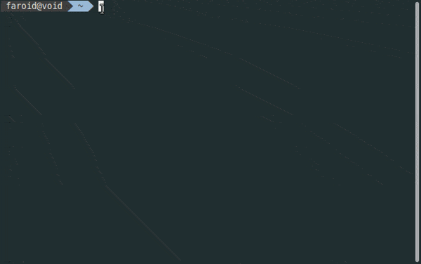

# Jadwal-Sholat-CLI
Showing Sholat Schedule everytime opening terminal (Linux/Mac/BSD)

### Prerequisites

- A Unix-like operating system: macOS, Linux, BSD.
- `wget` should be installed
- `jq` should be installed 
- `curl` should be installed

### Wget and Jq Installation

Wget and jq aren't installed by default on most editions of Linux/Mac/BSD, but you can install them by using this following command.

| Operating System    | Wget | Jq  | Curl                                                                                         |
|:--------------------|:-----------------------------------|:-------------|:--------------------------------------|
| **Debian Based**  | `sudo apt install wget` | `sudo apt install jq` |`sudo apt install curl`
| **Arch Based**  | `sudo pacman -S wget`   | `sudo pacman -S jq` | `sudo pacman -S curl`
| **Void Based**  | `sudo xbps-install wget`   | `sudo xbps-install jq` | `sudo xbps-install curl`
| **Redhat/Fedora Based** | `sudo yum install wget` | `sudo yum install jq` |`sudo yum install culr`
| **Mac** | `brew install wget` | `sudo brew install jq` |`sudo brew install curl`
| **FreeBSD** | `sudo pkg install wget` | `sudo pkg install jq` |`sudo pkg install curl`

### Usage
- Download jadwalSholat.sh and install.sh
- Open directory where you put those file in terminal then type `./install.sh` (make sure you change file permission to executable for install.sh)
- Type your city name

### Adding to Shell
| Shell    | Command                                                                                |
|:--------------------|:-----------------------------------|
| **Bash**  | `echo "sh ~/Apps/jadwalSholat.sh" >> .bashrc` |
| **Zsh**  | `echo "sh ~/Apps/jadwalSholat.sh" >> .zshrc`   |

### You're Rock
Now everytime you open your terminal you'll see upcoming Sholat Time
